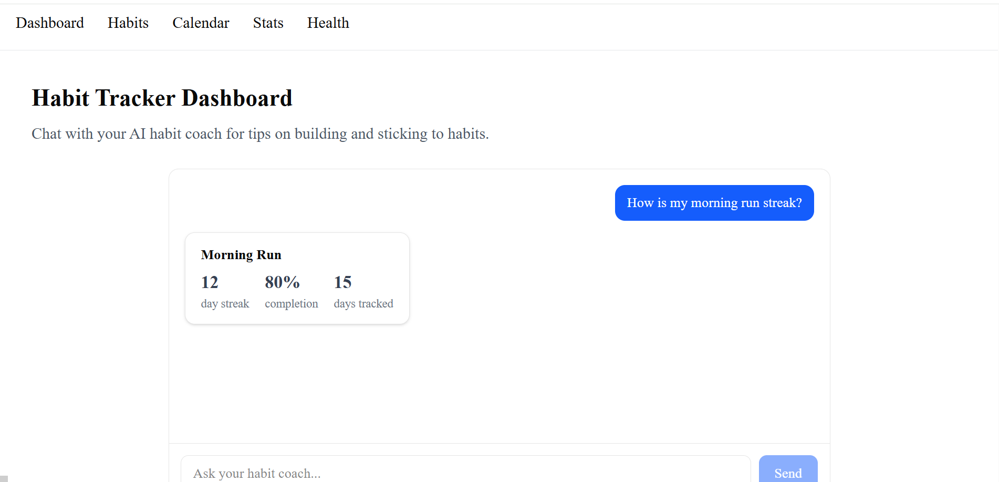
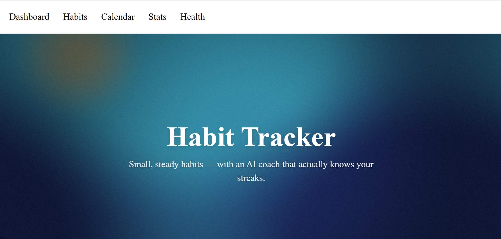

# Habit Tracker

A habit-tracking app with an AI coach built in — chat with it for habit advice, ask it to look up your streak stats, and it responds with real, structured data instead of guesses.

Built as part of the FlyRank AI Fluency internship, Frontend AI Engineering track.

## Live URL

**Production:** https://flyrank-capstone-gamma.vercel.app/

Other routes worth checking:
- `/habits` — a validated habit-entry form
- `/button-demo` — a stateful, animated button system
- `/scene` — an interactive 3D "streak orb"
- `/hero` — a custom GLSL shader hero

## Screenshots

## What it does

- Chat with an AI habit coach for short, practical, concrete suggestions
- The coach can call a real tool (`getHabitStats`) to look up streak/completion numbers for a habit and render them as a stat card — not hallucinated text
- Add habits through a validated form
- Handles failure gracefully: a dropped connection shows a designed error state with a working retry, not a crash
- A small interactive 3D scene and a custom shader hero, both built as part of the 3D/shader coursework and kept as real, working parts of the app rather than throwaway demos

## Architecture

- **Framework:** Next.js 16 (App Router), React 19
- **AI:** Vercel AI SDK (`streamText`, `useChat`) talking to Google's Gemini via `@ai-sdk/google`. The chat route (`app/api/chat/route.ts`) defines a Zod-typed tool (`getHabitStats`) and streams a UI message stream back to the client.
- **State:** all client state is local React state — no global store, since the app doesn't need one yet
- **Styling:** Tailwind CSS
- **3D/shaders:** React Three Fiber + drei for the streak orb, a hand-written GLSL fragment shader for the hero
- **Testing:** Vitest + React Testing Library for component tests (chat states, tool-result rendering, form validation), Playwright for one end-to-end test of the primary flow. Both run in GitHub Actions CI on every push.

## Run it locally

git clone https://github.com/MokshithaBevara/flyrank-capstone.git
cd flyrank-capstone
npm install

Create a `.env.local` file in the project root (see the Environment Variables table below), then:

npm run dev

Open http://localhost:3000.

To run the tests:

npm test # component tests (Vitest)
npm run test:e2e # end-to-end test (Playwright)

## Environment variables

| Variable | Required | Description |
|---|---|---|
| `GOOGLE_GENERATIVE_AI_API_KEY` | Yes | API key for Google's Generative AI (Gemini), used by the chat route. Get one from Google AI Studio. Set this in `.env.local` for local dev, and in Vercel's Environment Variables settings for production. |

## Production hygiene

- `maxDuration = 30` set on the streaming chat route, so a stuck request can't run indefinitely
- A simple per-IP rate limit (10 requests/minute) and a message-length cap (2000 characters) on the chat route, so a stranger can't casually spam it and drain the API budget. This is an in-memory, best-effort limiter — it resets on cold starts and isn't shared across serverless instances, which is a known limitation of not using a persistent store (like Redis) for this. Documented honestly rather than overstated.

## Cross-browser testing

Tested and working on:
- Chrome (primary development browser)
- Microsoft Edge
- Firefox

**Not tested:** Safari / mobile Safari — I don't have access to a Mac or iPhone. Mobile responsiveness was tested via Chrome DevTools' device emulation (touch, viewport sizing, `prefers-reduced-motion`), but that's not a substitute for a real Safari test, and I'm noting that gap honestly rather than claiming full cross-browser coverage.

## Decisions worth explaining

- **Sample/in-memory habit data instead of a real database:** the app doesn't have real persistent habit storage yet, so `getHabitStats` reads from a small hardcoded object in the route file. The tool's input/output contract is designed so swapping this for a real database later wouldn't require changing the tool itself.
- **In-memory rate limiting instead of a real rate-limiting service:** a proper solution (e.g. Upstash Redis) would work correctly across serverless cold starts; the in-memory version here is a reasonable stopgap for a project at this stage, not a production-grade solution, and I've said so above rather than pretending otherwise.

## How AI tools built this

I used Claude throughout this project, mostly through Claude.ai's chat interface, walking through each assignment step by step rather than having it generate the whole app unsupervised. Specifics:

- **Debugging real errors, not just writing code from scratch.** A recurring theme was the AI SDK's package versions being out of sync (`ai` package pinned to an old v4 while `@ai-sdk/react`/`@ai-sdk/google` expected v7), which caused a `TypeError` and later an `AI_UnsupportedModelVersionError`. Claude diagnosed both by reading the actual error stack and checking package registry data, rather than guessing.
- **Migrating the chat client from a hand-rolled fetch/SSE reader to the AI SDK's `useChat` hook**, when the app needed to support typed tool-call lifecycle states (input-streaming, input-available, output-available, output-error) for the FE-07 assignment.
- **Writing the GLSL shader** for the `/hero` page — Claude wrote the fragment shader and explained what each block does (the flow field, the mouse-distance "pull," the vignette, the grain pass), which I could then read back and understand well enough to explain it myself.
- **Setting up the whole test suite** (Vitest config, React Testing Library tests, mocking `useChat`, a Playwright end-to-end test with a mocked SSE response matching the AI SDK's actual wire protocol) and the GitHub Actions CI workflow, including debugging two real CI-only failures (Vitest accidentally picking up the Playwright spec file, and a Node version too old for a dependency).
- **Running and interpreting Lighthouse/WAVE audits**, then implementing the specific fixes they surfaced (a missing `aria-label` on the chat input, `aria-live` for streamed replies).
- I did not have Claude "vibe code" entire features blind — for each assignment, I ran the app myself after every change, reported back what actually happened (including several real bugs it didn't anticipate, like a debug line accidentally left in, or a file edit that silently didn't save), and it adjusted based on that real feedback rather than assuming success.

## What I'd add with more time

- Real habit persistence (a database instead of the sample in-memory data)
- A production-grade rate limiter (Upstash Redis or similar) instead of the in-memory one
- Actual Safari/mobile Safari testing on real hardware
- Wiring the 3D streak orb's color to a habit's actual real-time progress instead of being purely decorative

## Other coursework in this repo

A few things in this repo predate the capstone build and are kept as-is since they're real completed work, not clutter:

- **`WORKFLOW.md`** — a vague-vs-precise prompting comparison exercise (same feature, built twice with different prompt quality, comparing correctness, accessibility, and review effort).
- **`NOTES.md`** and **`playground/`** — a hand-built-vs-shadcn/ui accessibility comparison. `playground/Modal.tsx`, `Tabs.tsx`, and `Disclosure.tsx` are ARIA patterns implemented from scratch, then compared against `components/ui/` (shadcn primitives) to find real gaps (portal rendering, orientation support, uncontrolled state).
- **`app/calendar`, `app/health`, `app/stats`** — placeholder routes scaffolded early on, not yet built out. Only `/habits` and the dashboard chat are fully implemented.

## Adding the next case study

New projects go into this README as a new `## Project: <name>` section, using the same three-beat shape every time:

1. **Problem** — one or two sentences on what needed solving and why
2. **What I did** — the concrete approach, tools, and any real tradeoffs made
3. **What came of it** — the outcome: what shipped, what I learned, what I'd change

**Next piece of work:** Real habit persistence — replace the in-memory `SAMPLE_HABITS` object with an actual database (likely a simple hosted SQLite via Turso, or Postgres via Neon/Supabase), so habits added via the `/habits` form are real, the `getHabitStats` AI tool queries real data instead of a hardcoded object, and the Calendar/Stats/Health pages have real data to build against.